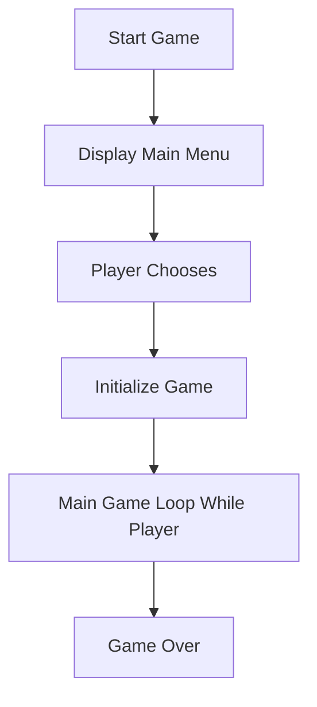

# Game-RPG-java

## 1. Latar Belakang

Latar belakang membuat game ini slain sebagai bagian penugasan dari mata kuliah praktikum dasar pemrograman, saya membuat game ini karena yang pertama saya menyukai game yang bertema kan rpg
dari kesukaan saya bermain game rpg membuat saya menjadi penasaran dan ingin membuat sebuah program game rpg sendiri

## 2. Deskripsi dan alur cerita dari game 

**Judul Game: "RealmSaga: Chronicles of Destiny"**

**Deskripsi Game:**
"Enhanced RPG" adalah permainan peran (RPG) sederhana yang menempatkan pemain dalam dunia fantasi yang penuh petualangan. Pemain akan mengambil peran sebagai seorang pahlawan yang memulai petualangan untuk mengalahkan berbagai musuh, meningkatkan level, dan mengumpulkan harta. Dengan senjata, sihir, dan keterampilan khusus, pemain harus melalui berbagai tantangan untuk mencapai tujuannya.

**Alur Cerita:**
Pemain memulai permainan sebagai seorang pahlawan muda yang baru saja memulai perjalanan mereka. Desa tempat tinggal pemain dikejutkan oleh munculnya makhluk-makhluk jahat yang mengancam perdamaian. Seorang bijak dari desa memberikan pemain senjata awal dan meminta mereka untuk menjadi pelindung desa.

Pemain kemudian menjelajahi berbagai wilayah, menghadapi berbagai musuh seperti goblin, skeleton, orc, dan troll. Setiap kali pemain berhasil mengalahkan musuh, mereka mendapatkan pengalaman, emas, dan mungkin item-item berharga lainnya. Pemain juga dapat menemukan potion untuk menyembuhkan diri dan senjata-senjata baru yang lebih kuat.

Saat pemain naik level, mereka mendapatkan kekuatan baru, kesehatan maksimum yang lebih tinggi, dan kesempatan untuk menemukan senjata-senjata legendaris. Pemain harus bijak memilih kapan menggunakan serangan khusus mereka dan kapan beristirahat untuk memulihkan kesehatan.

Petualangan mencapai puncaknya ketika pemain harus menghadapi bos akhir, musuh yang sangat kuat dan menantang. Jika pemain berhasil mengalahkan bos akhir, mereka diakui sebagai pahlawan desa dan selesai memenangkan permainan.

**Fitur Utama Game:**
1. **Pertarungan Dinamis:** Serangan biasa dan serangan khusus yang memerlukan strategi.
2. **Peningkatan Karakter:** Pemain dapat meningkatkan level, meningkatkan kesehatan, dan meraih kekuatan baru.
3. **Loot dan Pengumpulan:** Kesempatan untuk mendapatkan emas, potion, dan senjata-senjata legendaris.
4. **Tantangan Bos:** Pertarungan terakhir melawan bos yang menantang.
5. **Grafis Sederhana:** Antarmuka pengguna yang bersahaja dengan fokus pada gameplay.

## 3. Branding Game

A. Judul Game
" RealmSaga: Chronicles of Destiny "
"RealmSaga: Chronicles of Destiny" adalah dunia fantastis yang mengajak pemain untuk menjelajahi dunia yang penuh dengan misteri, kekuatan magis, dan pertempuran epik. Dengan grafis yang memukau dan cerita yang mendalam, game ini memberikan pengalaman RPG yang tak terlupakan, membangun legenda melalui pilihan pemain dan petualangan yang mengasyikkan.

B. Deskripsi Target Pengguna
Khususnya, pemain yang berada dalam kelompok usia remaja hingga dewasa muda.
Individu yang mencari game yang tidak hanya menawarkan gameplay yang menyenangkan, tetapi juga cerita yang mendalam dan pengalaman yang bersifat emosional.
Individu yang menyukai dan aktif memainkan permainan role-playing game (RPG), terutama yang menawarkan elemen dunia fantasi dan petualangan epik.

C. Genre
Game ini bergenre RPG (role-playing game)
RPG, atau Role-Playing Game, adalah genre game yang memungkinkan pemain mengambil peran karakter fiksi di dalam dunia yang diciptakan. Beberapa elemen umum dari game RPG melibatkan pengembangan karakter, perjalanan, dan seringkali cerita yang mendalam.

## 4. User Story

Sebagai | Saya bisa | Sehingga | Prioritas
---|---|---|---
Pemain |ingin memiliki tutorial yang terperinci untuk memahami kontrol permainan, karakteristik dasar, dan fitur-fitur utama |agar saya dapat dengan cepat memulai permainan  | ⭐⭐⭐
Pemain |menggerakan karakter |karakter dapat berjalan sesuai yang saya mau | ⭐⭐⭐⭐
Pemain |mendapatkan narasi cerita yang mendalam dan penuh nuansa dalam permainan |dapat terhubung emosional dengan karakter dan dunia dalam game | ⭐⭐⭐⭐
Pemain | berhadapan dengan berbagai musuh yang memiliki tingkat kesulitan yang meningkat |dapat menikmati game dengan pertarungan yang memiliki kesulitan semakin tinggi | ⭐⭐⭐⭐
Pemain |memiliki peta dunia yang luas dengan berbagai tempat untuk dijelajahi |dapat mengeksplorasi peta | ⭐⭐⭐
Pemain |dapat menyerang musuh |dapat mengalahkan semua musuh | ⭐⭐⭐⭐⭐
Pemain |mendapatkan senjata |dapat mengalahkan semua musuh | ⭐⭐⭐⭐
Pemain |mendapatkan skill atau kemampuan baru |meningkatkan kemampuan karakter | ⭐⭐⭐
Pemain | melihat grafis yang memukau, desain karakter yang indah, dan efek visual yang menakjubkan |sehingga pengalaman bermain menjadi lebih menarik | ⭐⭐⭐
Pemain |ingin memiliki pilihan pengembangan karakter yang beragam, termasuk pemilihan keterampilan, senjata, dan atribut |meningkatkan gaya bermain pemain | ⭐⭐⭐⭐

## 5. Desain user interface

(https://ibb.co/C5qDtYc)

## 6. Flow chart dari algoritma yang digunakan di dalam game 

## 7. Link Demo Game 

[link...](https://drive.google.com/file/d/1Z5U_mAxQnG8rrUKOK4BK9DOM71M5SGC-/view?usp=drive_link)

## 8. Kode Pemrograman Game 

(https://github.com/Dhikaaprtmaa/Game-RPG-java/blob/main/UltimateRPG.java)

## 9. Prinsip Dasar Pemrograman 

A. Variable 
Dalam game ini, variabel digunakan untuk menyimpan informasi seperti nama karakter, tingkat pemain, kesehatan, kerusakan, dan banyak lagi.

B. Data Type
Data type digunakan untuk mendefinisikan jenis nilai yang dapat disimpan dalam variabel. Dalam game ini, menggunakan tipe data seperti int, String, atau bahkan membuat tipe data kustom seperti Weapon atau Enemy.

C. Operator
Operator digunakan untuk melakukan operasi pada variabel atau nilai. Contohnya, operasi matematika untuk menghitung kerusakan saat pemain menyerang.

D. Boolean 
Tipe data boolean dan operator boolean sangat penting dalam membuat keputusan logis dalam game. Misalnya, Anda dapat menggunakan boolean untuk mengecek apakah pemain masih hidup atau apakah musuh sudah mati.

E. Conditional : if/else/switch
Pernyataan kondisional digunakan untuk mengambil keputusan berdasarkan kondisi tertentu. Dalam game, menggunakan ini untuk mengecek apakah pemain menyerang musuh atau apakah pemain perlu beristirahat.

F. Looping : for/While
Perulangan digunakan untuk menjalankan serangkaian perintah berulang kali. Dalam game, menggunakan perulangan untuk mengatur iterasi melalui musuh, memproses loot, atau menggerakkan karakter.

G. Array
Array digunakan untuk menyimpan sejumlah nilai dalam satu variabel. Dalam game, menggunakan array untuk menyimpan musuh, senjata, atau item lainnya.

H. Method 
Method atau fungsi digunakan untuk mengorganisir dan mengelompokkan blok kode yang dapat dipanggil. Dalam game, memiliki metode untuk menyerang, beristirahat, atau menampilkan statistik pemain.

I. Class
Class digunakan untuk mengorganisir kode ke dalam entitas yang terkait. Dalam game ini,  memiliki kelas untuk pemain, musuh, senjata, dan sebagainya.

## Bagaimana konsep variable, data type dan operator pada bahasa pemrograman digunakan dalam pembuatan game ini ?

Dalam pembuatan game ini, konsep variabel, tipe data, dan operator digunakan secara luas untuk mengelola informasi dan logika permainan. Berikut adalah beberapa contoh penggunaan konsep tersebut:
Variabel:
Variabel digunakan untuk menyimpan dan memanipulasi data yang berubah selama permainan. Beberapa contoh variabel yang dapat digunakan dalam game ini adalah:
Player Variables:
name: Menyimpan nama pemain.
level: Menyimpan level pemain.
experience: Menyimpan total pengalaman pemain.
health: Menyimpan kesehatan pemain.
damage: Menyimpan kekuatan serangan pemain.
gold: Menyimpan jumlah emas yang dimiliki pemain.
potions: Menyimpan jumlah potion yang dimiliki pemain.
Enemy Variables:
name: Menyimpan nama musuh.
level: Menyimpan level musuh.
currentHealth: Menyimpan kesehatan saat ini musuh.
damage: Menyimpan kekuatan serangan musuh.
Game State Variables:
maxHealth: Menyimpan kesehatan maksimum yang dapat dimiliki pemain.
weapon: Menyimpan senjata yang dimiliki pemain.
currentEnemy: Menyimpan musuh yang sedang dihadapi pemain.
gameOver: Menyimpan status apakah permainan sudah berakhir atau belum.
Tipe Data:
Tipe data digunakan untuk menentukan jenis nilai yang dapat disimpan dalam variabel. Beberapa contoh tipe data yang mungkin digunakan dalam game ini:
String:
Digunakan untuk menyimpan nama pemain, nama musuh, dan nama senjata.
Integer:
Digunakan untuk menyimpan nilai-level, experience, health, damage, gold, dan potion counts.
Boolean:
Digunakan untuk menyimpan status seperti gameOver.
Object:
Digunakan untuk menyimpan objek-objek kompleks seperti senjata (Weapon).
Operator:
Operator digunakan untuk melakukan operasi pada variabel dan nilai. Beberapa contoh operator yang digunakan dalam game ini:
Aritmetika:
+, -, *, / digunakan untuk operasi matematika seperti penjumlahan, pengurangan, perkalian, dan pembagian.
Penugasan:
= digunakan untuk menugaskan nilai ke variabel.
Perbandingan:
==, !=, <, >, <=, >= digunakan untuk membandingkan nilai.
Logika:
&& (AND), || (OR), ! (NOT) digunakan untuk operasi logika.
Increment/Decrement:
++, -- digunakan untuk menambah atau mengurangkan nilai satu.

## Bagaimana konsep boolean dan conditions pada bahasa pemrograman digunakan dalam pembuatan game ini ?

Konsep boolean dan kondisi (conditions) sangat penting dalam pembuatan game ini untuk mengontrol alur permainan, mengambil keputusan, dan mengendalikan perilaku permainan berdasarkan situasi tertentu.

Penggunaan kondisi dan nilai boolean sangat penting dalam memberikan dinamika pada game. Mereka memungkinkan game untuk merespons interaksi pemain, mengatur perubahan dalam game, dan memberikan pengalaman yang lebih menarik dan bervariasi kepada pemain.

## Bagaimana konsep looping dan array pada bahasa pemrograman digunakan dalam pembuatan game ini ?

Konsep looping dan array menjadi krusial dalam pembuatan game untuk melakukan iterasi melalui sejumlah data, mengatur perulangan, dan mengelola elemen-elemen seperti senjata, musuh, atau item.
Konsep looping dan array memungkinkan pengembang game untuk mengelola dan memproses data secara efisien, membuat pengulangan melalui daftar musuh, senjata, atau elemen game lainnya. Hal ini juga memungkinkan fleksibilitas dalam menangani perubahan dinamis selama permainan berlangsung.

## Bagaimana konsep method pada bahasa pemrograman digunakan dalam pembuatan game ini ?

Konsep metode (method) dalam bahasa pemrograman digunakan dalam pembuatan game ini untuk mengorganisir dan memisahkan logika program ke dalam blok-blok kode yang dapat dipanggil dan digunakan Kembali
Contoh nya method untuk menyerang musuh, method untuk serangan khusus, method untuk naik level dan masih banyak lagi

## Bagaimana konsep class pada bahasa pemrograman digunakan dalam pembuatan game ini ?

Konsep class pada bahasa pemrograman digunakan dalam pembuatan game ini untuk mengorganisir dan mengelompokkan berbagai entitas dan fungsionalitas yang terkait. Dalam game ini, ada beberapa class yang merepresentasikan entitas dan fitur-fitur dalam permainan.
Contohnya class character, class enemy, player, weapon dan lain lain 

## Jelaskan algoritma buatan sendiri yang digunakan pada pembuatan game ini !

Pengembangan algoritma pada game yang dibuat melibatkan beberapa tahapan, terutama dalam mengatur logika pertarungan, mekanisme serangan, pemberian damage, dan manajemen status pemain dan musuh. Berikut adalah penjelasan lebih lanjut:
Inisialisasi Karakter:

Pada awalnya, pemain diminta untuk memasukkan nama karakter.
Objek pemain (Player) dan musuh pertama (Character) dibuat dengan menggunakan input pengguna dan metode generateRandomEnemy().
Pertarungan Berulang:

Sebuah loop while digunakan untuk menjalankan pertarungan selama kesehatan pemain masih di atas 0 dan musuh belum dikalahkan.
Pilihan Aksi Pengguna:

Pemain diberikan opsi untuk memilih aksi (serang, serangan khusus, istirahat, gunakan potion) melalui pernyataan kondisional (switch).
Setiap pilihan mengarah pada metode yang sesuai dalam class Player.
Serangan Pemain:
